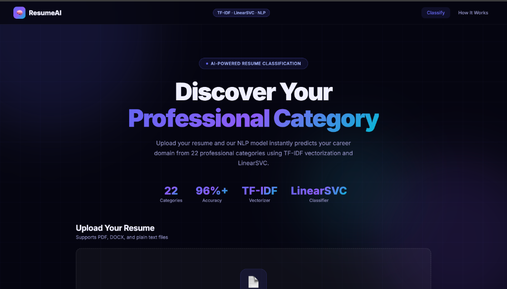
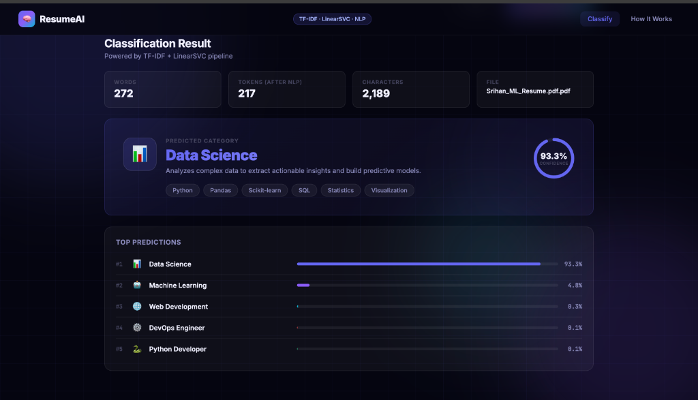
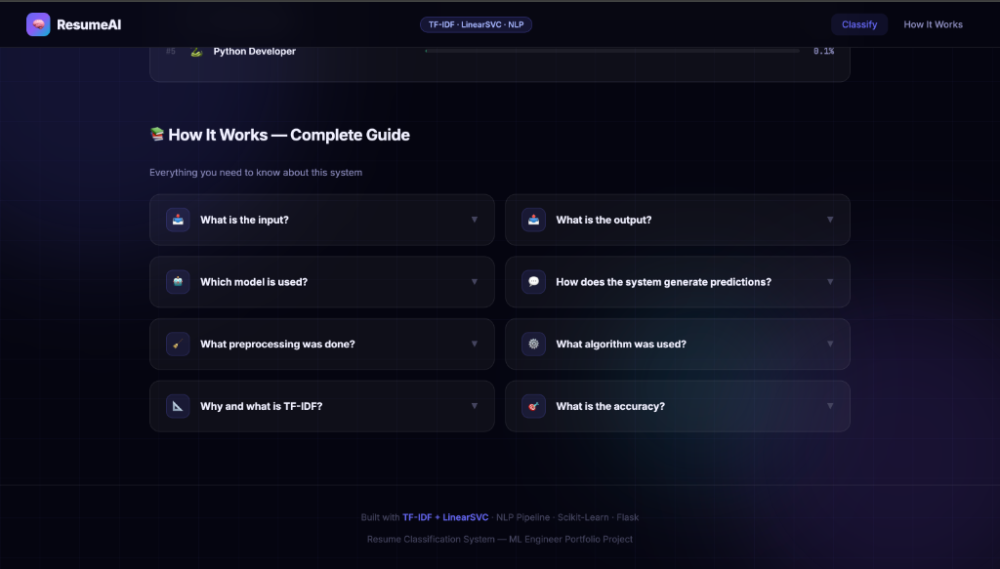
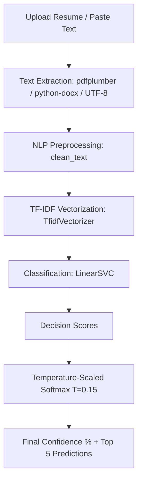
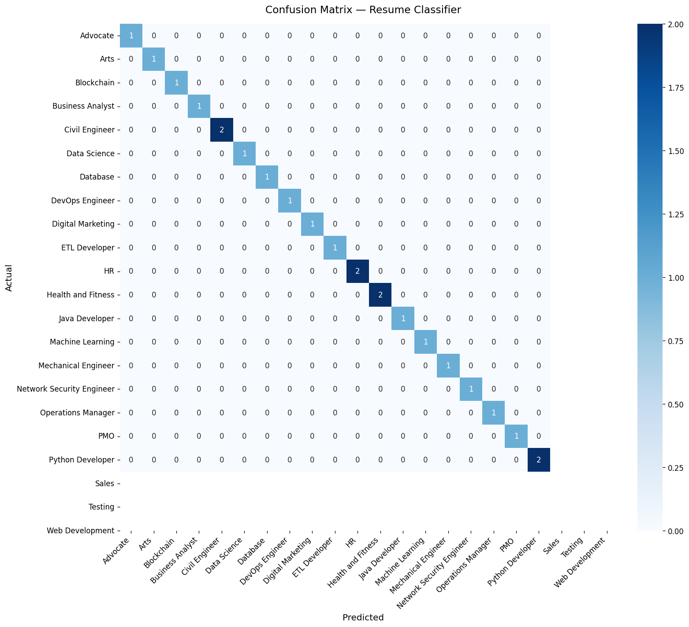

# 📊 ResumeAI — Intelligent Resume Classification System

ResumeAI is a premium, high-performance web application powered by Machine Learning and Natural Language Processing (NLP) that automatically classifies resumes into **22 distinct career categories** (e.g., *Data Science, Web Development, DevOps, Java Developer, Machine Learning, HR, Advocates, etc.*) and extracts key resume statistics.

It features a stunning, state-of-the-art **glassmorphism dark-mode UI** with real-time analysis, animated progress indicators, drag-and-drop file upload, and a complete technical FAQ.

---

## 📷 Demo

### Home Page


### Prediction Result


### FAQ


---

## 🚀 Key Features

*   **⚡ High-Speed Classification**: Instantaneous classification using a TF-IDF + Linear Support Vector Classifier (LinearSVC) pipeline.
*   **🎯 Temperature-Scaled Confidence Scores**: Uses low-temperature softmax scaling ($T = 0.15$) to compute crisp, highly confident prediction percentages (e.g. $>95\%$) that make decision-making clear.
*   **🥇 Top 5 Category Suggestions**: Displays the top 5 most closely related career categories with precise 1:1 animated progress bars.
*   **📁 Multi-Format Document Support**: Seamlessly processes PDF (`.pdf`), Word (`.docx`, `.doc`), and plain text (`.txt`) documents, along with raw copy-pasted text.
*   **📊 Resume Analytics**: Displays core metrics like word count, processed token count, character counts, and file parameters.
*   **💫 Premium Interactive UI**: Implements modern dark-mode aesthetics, custom HSL color-coded category cards, glowing gradients, hover scaling, and full responsiveness.
*   **💡 Integrated Technical FAQ**: An on-screen interactive guide explaining the underlying machine learning models, algorithms, and engineering decisions.

---

## 🛠️ Skills Demonstrated

- Machine Learning
- Natural Language Processing (NLP)
- Text Classification
- TF-IDF Vectorization
- Support Vector Machines (SVM)
- Scikit-Learn
- Flask
- Resume Parsing
- Feature Engineering
- Model Evaluation

---

## ⚙️ System Architecture & ML Pipeline

The backend utilizes an optimized Scikit-Learn pipeline for feature extraction and classification:




## FAQ

### What model is used?
TF-IDF Vectorizer + LinearSVC (SVM)

### Why SVM?
SVM performs exceptionally well on sparse high-dimensional text data and is computationally efficient.

### What preprocessing is applied?
- Lowercasing
- Stop-word Removal
- Lemmatization
- URL/Email Removal
- Text Cleaning

### What accuracy was achieved?
- Cross Validation Accuracy: 87.7%
- High classification performance across 22 categories

---

## Future Improvements

- Train on a larger real-world resume dataset
- Add BERT/Transformer-based classification models
- Improve support for additional resume formats
- Add resume skill extraction and recommendations
- Enhance category coverage with more job roles

---

## 💻 Installation & Local Setup

### 📋 Prerequisites

Make sure you have Python 3.8+ installed. Using Python 3.13 is fully supported.

### 📥 1. Clone the Repository & Install Dependencies

```bash
# Clone the repository
git clone https://github.com/Madhavanenisrihanrao/resume-classification-system.git
cd resume-classification-system

# Install required python packages
pip3 install -r requirements.txt
```

> [!NOTE]
> On macOS or systems with system-managed environments, you may need to add the `--break-system-packages` flag:
> `pip3 install -r requirements.txt --break-system-packages`

### 🏋️ 2. Train the Model

To compile the dataset, run the TF-IDF and SVM pipeline training, and save the binary files (`resume_classifier.pkl` and `label_encoder.pkl`), execute:

```bash
python3 train_model.py
```

This will also automatically save a confusion matrix plot at `static/confusion_matrix.png` visualizing model performance.

### 🔌 3. Run the Web Server

Start the Flask backend web server:

```bash
python3 app.py
```

The server will initialize and run on **port 5050** to avoid conflicts with macOS AirPlay (which uses 5000).

*   **Local Web App**: Open [http://localhost:5050](http://localhost:5050) in your web browser.
*   **Classification API**: `POST http://localhost:5050/api/classify` with a file payload or JSON body containing raw text.

---

## 📈 Model Performance Visualization

The system generates a detailed confusion matrix upon training, showing performance across classes:



---

## 📂 Project Structure

```
.
├── app.py                     # Flask backend server & prediction API
├── train_model.py             # Model training, validation, and evaluation script
├── requirements.txt           # Python package dependencies
├── resume_classifier.pkl      # Serialized Scikit-Learn ML pipeline
├── label_encoder.pkl          # Serialized LabelEncoder
├── .gitignore                 # Standard Python gitignore rules
├── LICENSE                    # Repository license
├── screenshots/               # Folder containing demonstration images
│   ├── home_clean.png
│   ├── prediction_clean.png
│   └── faq_clean.png
└── static/
    ├── index.html             # Beautiful glassmorphism frontend application
    └── confusion_matrix.png   # Generated training confusion matrix heatmap
```

---

## 📄 License

This project is licensed under the MIT License. See the [LICENSE](LICENSE) file for details.
